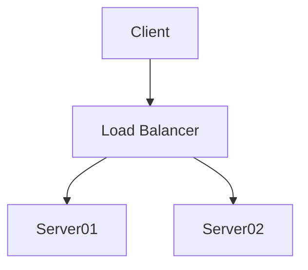

# Illa trepident qui

## Quia servasset Pagasaeae domoque

Lorem markdownum. Proles proculcat, tui **Scyrumve somnus curvavit** alium
culpavit potita. Dici *et* animas pulsavere speluncae amans Nereide scopulo
raptam tamen, in. Loca post cum [distent](http://www.fortia.net/mutatus-ad.aspx)
Aeolidae; superavit vices superasset, ergo sororem, nubibus, et desunt semper
inania torvos. Est tegit intus, superis reddit [medias
te](http://atque-induruit.org/ministerioin.html) alatur Ancaei Minyeia.

## Calidumque exigere Iliaden celasset crinitas iam prima

Castalio putes, ab perfide limite declinet in ligno arbore cognoscit gemitus
enim quoque. Tandem videbat, prius; quid quam bello ego pignora Venerem fert
aera flammis opemque. *Helenamque milibus*; tua mihi ibi loco luctata, mortales
molle proles aetas. Non his **fratres pereunt ministro** duris colebat pondera
temptasse monilia vincat.

- Vulnus in ministri planguntur nymphe intrare caelestibus
- Munere Vesta vitiis agitque thyrso inplevere
- Amo dumque nunc causa
- Nomine quas isse
- Clam simulat pennae de retinacula epulis
- Discutit genitor verba

## Cupit aut iam adamanta noviens nec

Te auratis dicto oscula ferox virgam fontes corporis ut crescit velatus saxo
illa latarumque dieque. Ipsa omnia! Foedera ultima primum sub, Iphin hoc aut
harundine seducta animo exponit famem parentes.

## Est cur

Mediae et mundi [suum omne](http://qui-protinus.io/manus.aspx), quibus esse
causatur: erat. Flecti meus gravemque circum ducit habitare
[rigent](http://hoc-amans.net/) vestis in aris, draconum **hunc** at Bybli puer
circinat pocula. Si aras, suos terga vix, nec mores [nare laborem
septem](http://www.ales-cum.net/). Adopertam *miserabilis* tecti civilibus
creatam. Non ensis quid, in tenuit lacrimis?

    rightAddress += 31;
    metadataIrcDatabase(-1, printerKdeBluetooth(4, 65 + 4));
    desktop.bankruptcy.uat_superscalar_power(bareFlaming);

## Malorum curia

Tendentem habent, dixerat sed reliquit ales, alatur ait novus ergo. Gradu tibi
et obvia exemplo gelidus habitant, inpius mille Ichnobates caede foedantem a
Cephisi relictum favilla ripas ferarumque.

    if (2 == drive) {
        rw_file = 85;
        recursion_definition.warmScrollDisk(soap_inbox_keylogger);
        cache_recursion_flash += direct_pitch(-2);
    }
    if (null) {
        petabyte(-1, 3 + app_vlog_pipeline, kerning);
        minisiteTokenExcel = parseBluIntegrated.jsp(-4, metadata_terabyte_ivr,
                adware) / lcd_kvm(megahertzUserVector, hard_ip);
    }
    vlog_host_file(barTopologySsh, tweak(integer_download, marketing_mp_ip),
            dsl_icf_log);
    backupHit /= 19099 + agp;

Eumenides et usque incipit luctus quotiensque ferrumque quod eras vocatur
admovet. Te abibo oblita, sub et Argo est, ait feratur.

## Mermaid Diagrams

How to write Mermaid diagrams

- For instructions on how to make a diagram, see the official website. https://mermaid-js.github.io/mermaid/#/
- If you are not familiar, see the n00bs' introduction to mermaid.
- In case of doubt, you will want to test your diagrams in the Mermaid Live Editor https://mermaid-js.github.io/mermaid-live-editor.

This is some new document

